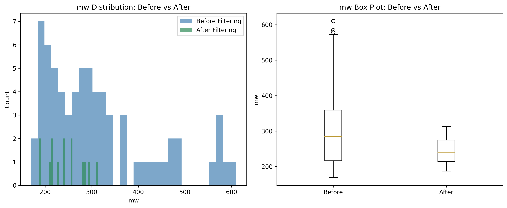
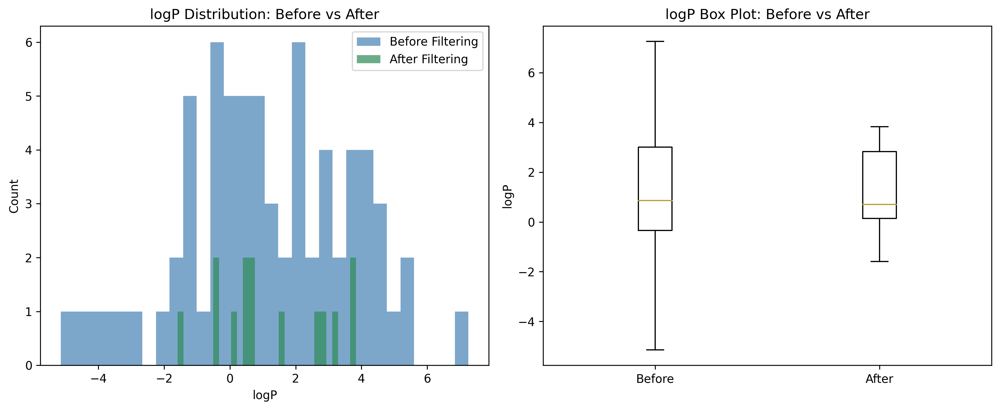
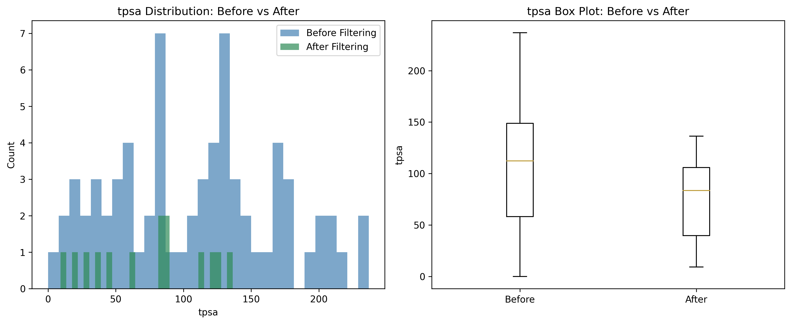
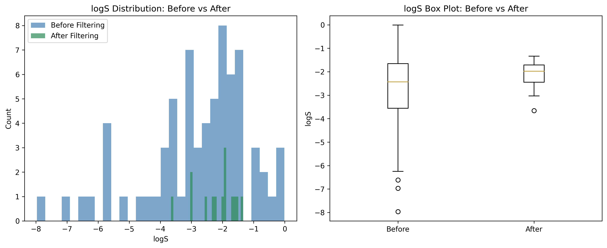
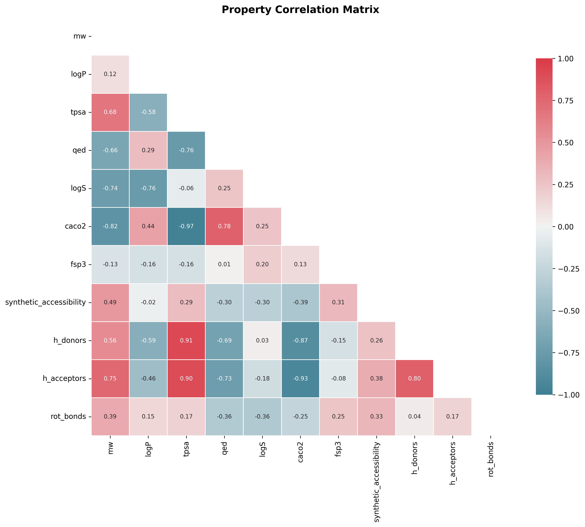
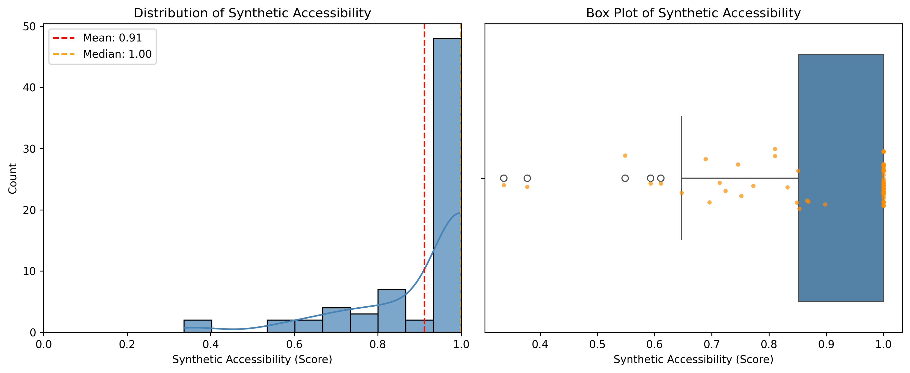

git add README.mdox Pipeline
git commit -m "Update README image paths to images/"
git push -u origin mainicting ADME/Tox (Absorption, Distribution, Metabolism, Excretion, and Toxicity) properties with enhanced visualization and statistical analysis capabilities.
  - Synthetic Accessibility

### 📊 **Enhanced Visualization**
- **Publication-Quality Plots**: Beautiful histograms, box plots, and distribution analysis
- **Correlation Matrices**: Heatmaps showing relationships between molecular properties
- **Radar Charts**: Multi-property comparison charts
- **Rule Violation Heatmaps**: Visual patterns of filter failures
- **Before/After Comparisons**: Distribution changes post-filtering
- **Interactive HTML Reports**: Comprehensive summary reports

### ⚡ **Performance & Usability**
- **Parallel Processing**: Multiprocessing support for large datasets
- **Flexible Input**: Multiple SMILES and ID column naming conventions
- **Comprehensive Output**: Excel files with multiple sheets and detailed explanations
- **Robust Error Handling**: Graceful failure recovery and detailed logging

## Example Visualizations

### Property Distributions Before and After Filtering

The pipeline generates comparison plots for key molecular properties, showing the distribution of compounds before and after applying the ADME/Tox filters.

#### Molecular Weight (MW) Distribution

- **Description**: Distribution of molecular weight before and after filtering. Molecular weight is a key parameter in Lipinski's Rule of Five and GSK rules.

#### LogP (Octanol-Water Partition Coefficient)

- **Description**: Distribution of LogP values before and after filtering. LogP measures lipophilicity and is crucial for membrane permeability predictions.

#### Topological Polar Surface Area (TPSA)

- **Description**: Distribution of TPSA values before and after filtering. TPSA is a key descriptor for membrane permeability and follows Veber's rules.

#### Fraction of sp3 Carbons (Fsp3)

- **Description**: Distribution of Fsp3 before and after filtering. Fsp3 is a measure of carbon saturation and is associated with better drug-likeness.

#### Predicted Caco-2 Permeability

- **Description**: Distribution of predicted Caco-2 permeability before and after filtering. Caco-2 is a model for intestinal absorption.

#### Predicted Aqueous Solubility (LogS)

- **Description**: Distribution of predicted LogS values before and after filtering. LogS predicts aqueous solubility, a critical property for oral bioavailability.

#### Quantitative Estimate of Drug-likeness (QED)

- **Description**: Distribution of QED scores before and after filtering. QED provides a comprehensive measure of drug-likeness.

### Advanced Statistical Visualizations

#### Property Correlation Matrix

- **Description**: Heatmap showing correlations between different molecular properties. Helps identify relationships between structural features and predicted properties.

#### Rule Violation Heatmap

- **Description**: Visual representation of which compounds failed which filters. Each row represents a filter rule, and each column represents a compound.

#### Property Radar Chart

- **Description**: Radar chart showing the distribution of multiple properties simultaneously, with percentile ranges displayed.

#### Individual Property Distributions

##### Synthetic Accessibility Score

- **Description**: Distribution of synthetic accessibility scores, which estimate how easily a compound can be synthesized.

##### Fsp3 Distribution

- **Description**: Detailed distribution of fraction of sp3 carbons, an important metric for compound complexity.

##### Caco-2 Permeability Distribution

- **Description**: Detailed distribution of predicted Caco-2 permeability values.

## Installation

### Prerequisites

- Python 3.7 or higher
- RDKit (required for chemical informatics)

### Quick Install

```bash
# Using conda (recommended)
conda create -n admet-pipeline python=3.9
conda activate admet-pipeline
conda install -c conda-forge rdkit pandas numpy matplotlib seaborn openpyxl scipy

# Using pip
pip install rdkit-pypi pandas numpy matplotlib seaborn openpyxl scipy
```

### Optional Dependencies

For additional visualization features:

```bash
pip install plotly  # For interactive plots
pip install scikit-learn  # For advanced statistical analysis
```

## Usage

### Basic Usage

```bash
python admet_pipeline_enhanced.py input_compounds.csv
```

### Advanced Usage

```bash
python admet_pipeline_enhanced.py input_compounds.csv \
  --output results.xlsx \
  --smiles-col "SMILES" \
  --id-col "Compound_ID" \
  --n-jobs 4 \
  --generate-html
```

### All Command Line Options

| Option | Description | Default |
|--------|-------------|---------|
| `input` | Input CSV file with SMILES (required) | - |
| `-o, --output` | Output Excel file | `input_admet_enhanced.xlsx` |
| `--smiles-col` | SMILES column name | `smiles` |
| `--id-col` | ID column name | `CID` |
| `--no-pains` | Disable PAINS filtering | `False` |
| `--n-jobs` | Number of parallel workers | CPU count - 1 |
| `--qed-threshold` | QED score threshold | `0.55` |
| `--logs-threshold` | LogS threshold (log mol/L) | `-4.0` |
| `--caco2-threshold` | Caco-2 threshold (log nm/s) | `1.85` |
| `--fsp3-threshold` | Fsp3 threshold | `0.42` |
| `--generate-html` | Generate HTML report | `False` |

## Input Format

### Required CSV Columns
- **SMILES**: Molecular structures in SMILES format
- **ID Column**: Compound identifiers (default: 'CID')

### Example Input
```csv
CID,smiles,Name
compound1,CC(=O)OC1=CC=CC=C1C(=O)O,Aspirin
compound2,CN1C=NC2=C1C(=O)N(C(=O)N2C)C,Caffeine
compound3,C1=CC=C(C=C1)C=O,Benzaldehyde
```

## Output

### Excel File (`*_admet_enhanced.xlsx`)
- **Results Sheet**: Complete analysis results for all compounds
- **Filter_Explanations**: Detailed descriptions of each filter rule
- **Parameters**: Analysis parameters and thresholds used
- **Summary**: Visualizations and summary statistics

### Generated Plots (`*_plots/` directory)
- **Distribution Plots**: Histograms and box plots for all molecular properties
- **Correlation Matrix**: Relationships between different properties
- **Radar Charts**: Multi-property visualization
- **Violation Heatmaps**: Pattern analysis of filter failures
- **Comparison Plots**: Before/after filtering distributions (as shown above)

### HTML Report (optional)
- Interactive summary with all visualizations
- Statistical overview
- Filter performance metrics

## Molecular Properties Calculated

| Property | Description | Units |
|----------|-------------|-------|
| MW | Molecular Weight | Da |
| LogP | Octanol-water partition coefficient | - |
| HBD | Hydrogen Bond Donors | count |
| HBA | Hydrogen Bond Acceptors | count |
| Rotatable Bonds | Number of rotatable bonds | count |
| TPSA | Topological Polar Surface Area | Ų |
| QED | Quantitative Estimate of Drug-likeness | score (0-1) |
| Fsp3 | Fraction of sp3 carbons | fraction |
| LogS | Predicted aqueous solubility | log mol/L |
| Caco-2 | Predicted intestinal permeability | log nm/s |
| Synthetic Accessibility | Estimated synthetic complexity | score (0-1) |

## Filter Rules

### Lipinski's Rule of Five
- Molecular Weight ≤ 500 Da
- LogP ≤ 5
- Hydrogen Bond Donors ≤ 5
- Hydrogen Bond Acceptors ≤ 10
- *Allowed: Up to 1 violation*

### Veber's Rules
- Rotatable Bonds ≤ 10
- TPSA ≤ 140 Ų

### GSK-like Rules
- Molecular Weight ≤ 400 Da
- LogP ≤ 4

### Additional Filters
- **PAINS**: Pan-assay interference compounds
- **QED**: Quantitative Estimate of Drug-likeness > threshold
- **LogS**: Predicted solubility ≥ threshold
- **Caco-2**: Predicted permeability ≥ threshold
- **Fsp3**: Fraction of sp3 carbons ≥ threshold

## Examples

### Example 1: Basic Analysis
```bash
python admet_pipeline_enhanced.py my_compounds.csv
```

### Example 2: Custom Thresholds
```bash
python admet_pipeline_enhanced.py my_compounds.csv \
  --qed-threshold 0.6 \
  --logs-threshold -5.0 \
  --caco2-threshold 2.0 \
  --fsp3-threshold 0.5
```

### Example 3: High-Performance Analysis
```bash
python admet_pipeline_enhanced.py large_dataset.csv \
  --n-jobs 8 \
  --output large_analysis.xlsx \
  --generate-html
```

## Troubleshooting

### Common Issues

1. **Missing Dependencies**
   ```bash
   # Error: "Missing dependencies"
   pip install pandas numpy matplotlib seaborn openpyxl scipy
   ```

2. **RDKit Installation**
   ```bash
   # Conda installation (recommended)
   conda install -c conda-forge rdkit
   ```

3. **Memory Issues with Large Datasets**
   ```bash
   # Use fewer parallel processes
   python admet_pipeline_enhanced.py large_file.csv --n-jobs 2
   ```

4. **Column Not Found**
   ```bash
   # Specify correct column names
   python admet_pipeline_enhanced.py data.csv --smiles-col "SMILES_string" --id-col "Molecule_ID"
   ```

## Citation

If you use this pipeline in your research, please cite:

```bibtex
@software{admet_pipeline_2025,
  title = {Enhanced ADME/Tox Pipeline},
  author = {Dip Kumar Ghosh},
  year = {2025},
  url = {https://github.com/Deon-07/Enhanced-ADME-Tox-Pipeline}
}
```

## License

This project is licensed under the MIT License - see the [LICENSE](LICENSE) file for details.

## Contributing

Contributions are welcome! Please feel free to submit pull requests or open issues for bugs and feature requests.

### Development Setup
```bash
git clone https://github.com/Deon-07/Enhanced-ADME-Tox-Pipeline
cd admet-pipeline
pip install -e .
```

## Support

For questions, issues, or contributions:
- Open an issue on [GitHub](https://github.com/Deon-07/Enhanced-ADME-Tox-Pipeline)
- Contact: dipkumarghosh@duck.com
- LinkedIn: [https://www.linkedin.com/in/dip-kr-ghosh/](https://www.linkedin.com/in/dip-kr-ghosh/)

---

**Note**: This tool is intended for research purposes only. Always validate predictions with experimental data for critical applications.
